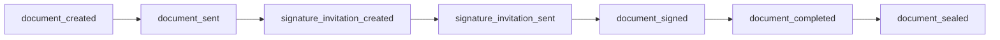

# Document signing webhooks

Receive real-time **HTTP POST** notifications when documents move through the signing lifecycle. Webhooks are configured per document (inline `webhookConfig`) or via **central webhook endpoints** bound to a document or template in the Cleared portal.

Signer-facing email settings (`notifications`) do **not** affect webhook delivery.

## Configuration

| Method | Where |
|--------|--------|
| **Inline on document** | `webhookConfig.url`, `webhookConfig.secret`, `webhookConfig.active` on the document record |
| **Central endpoint** | Cleared portal → Webhooks → create endpoint → bind to document or template |
| **Event filter** | Optional `subscribedEvents` on each binding — omit or leave unset to receive **all** events listed below; use a string array to whitelist specific event names |

Each binding can target one HTTPS URL. Multiple bindings may fire for the same event.

## Request format

Cleared sends an **HTTP POST** with:

| Header | Value |
|--------|--------|
| `Content-Type` | `application/json` |
| `X-Webhook-Signature` | `sha256=<hex>` — HMAC-SHA256 of the **raw JSON body** using your webhook secret |

Your endpoint should:

- Respond with **2xx** promptly
- Verify the signature before processing
- Treat deliveries as **at-least-once** (the same event may be posted more than once); use `documentId`, `event`, and `occurredAt` (or signer fields) for idempotency

## Event catalog

All event names use **snake_case**. Payloads include `"schemaVersion": "2026-04-30"` unless noted.

| Event | Category | When Cleared sends it |
|-------|----------|------------------------|
| `document_created` | Lifecycle | A new document is created from a template (instantiate). |
| `document_sent` | Lifecycle | A document or envelope is sent for signing and queued for signer outreach. |
| `signature_invitation_created` | Signing | A signing URL is ready for an eligible signer (including when invitation emails are muted and you deliver links yourself). |
| `signature_invitation_sent` | Signing | Cleared successfully sends the invitation email to the signer. |
| `document_signed` | Signing | A signer submits their signature (**one webhook per signer submission**). |
| `document_completed` | Signing | All required signers have signed. The document may proceed to digital certificate application if enabled. |
| `document_sealed` | Finalization | The legally binding digitally signed PDF is ready; document status is **completed**. |

### Typical order



Not every document emits every event (for example, `document_created` applies only when created from a template). `document_sealed` is sent when digital certificate signing is enabled and processing finishes successfully.

## Payload overview

### Lifecycle and signing events (`document_created`, `document_sent`, `document_signed`, `document_completed`, `document_sealed`)

These payloads share a common structure:

| Field | Description |
|-------|-------------|
| `schemaVersion` | Payload format version (e.g. `2026-04-30`) |
| `event` | Event name (same as catalog above) |
| `documentId` | Document identifier |
| `documentStatus` | Current document status at time of dispatch |
| `occurredAt` | ISO 8601 timestamp |
| `signers` | Array of signing parties with status, order, and per-signer field summary |
| `signerSummary` | Counts: total, signed, pending |
| `currentSigner` | Signer most relevant to this event (`name`, `email`, `signedAt`) when applicable |
| `unassignedFields` | Fields not assigned to a signer (when field values are included) |
| `fieldSummary` | Aggregate field counts |
| `documentLink` | Time-limited HTTPS URL to download the current PDF (when available) |
| `documentLinkExpiresAt` | When `documentLink` expires |
| `documentLinkTtlSeconds` | Link lifetime in seconds |
| `documentContentBase64` | Base64-encoded PDF (when available and included for your configuration) |
| `documentContentSha256` | SHA-256 hash of the PDF bytes |
| `documentContentBytes` | PDF size in bytes |

Sensitive field types (signatures, images, passwords, etc.) are **redacted** in field summaries; plain text fields may appear when permitted.

**Event-specific extras**

| Event | Additional fields |
|-------|-------------------|
| `document_created` | `title`, `status`, `source`, optional `templateId` |
| `document_sent` | `title`, `status`, `source` |
| `document_signed` | `signerName`, `signerEmail`, `signedAt`, `allSigned`, `documentStatus`, optional `queuedForDigitalSignature`, optional `awaitingIdVerificationClearance` |
| `document_completed` | `signerName`, `signerEmail`, `completedAt`, `allSigned: true`, optional `queuedForDigitalSignature` |
| `document_sealed` | `sealedAt`, `documentStatus: completed` |

### Invitation events (`signature_invitation_created`, `signature_invitation_sent`)

Lighter payload focused on the signer link:

| Field | Description |
|-------|-------------|
| `event` | `signature_invitation_created` or `signature_invitation_sent` |
| `documentId` | Document identifier |
| `signerId` | Signer identifier |
| `signerEmail` | Signer email |
| `signerName` | Signer display name |
| `signingUrl` | URL the signer opens to sign |
| `envelopeId` | Present when the document belongs to an envelope |
| `documentTitles` | Titles of documents in an envelope invitation |
| `documents` | Per-document rows in an envelope invitation |
| `deliveryChannel` | `link` (URL materialised only) or `email` (invitation email sent) |
| `occurredAt` | ISO 8601 timestamp |

## Examples

### `document_signed` (partial signer)

```json
{
  "schemaVersion": "2026-04-30",
  "event": "document_signed",
  "documentId": "507f1f77bcf86cd799439011",
  "documentStatus": "pending_signatures",
  "occurredAt": "2026-06-08T14:22:00.000Z",
  "signerName": "Jane Smith",
  "signerEmail": "jane@example.com",
  "signedAt": "2026-06-08T14:22:00.000Z",
  "allSigned": false,
  "currentSigner": {
    "name": "Jane Smith",
    "email": "jane@example.com",
    "signedAt": "2026-06-08T14:22:00.000Z"
  },
  "signerSummary": { "total": 2, "signed": 1, "pending": 1 },
  "documentLink": "https://files.cleared.id/...",
  "documentLinkExpiresAt": "2026-07-08T14:22:00.000Z",
  "documentLinkTtlSeconds": 2592000
}
```

### `document_completed`

```json
{
  "schemaVersion": "2026-04-30",
  "event": "document_completed",
  "documentId": "507f1f77bcf86cd799439011",
  "documentStatus": "ready_for_digital_signature",
  "occurredAt": "2026-06-08T15:00:00.000Z",
  "allSigned": true,
  "queuedForDigitalSignature": true,
  "completedAt": "2026-06-08T15:00:00.000Z",
  "signerSummary": { "total": 2, "signed": 2, "pending": 0 }
}
```

### `document_sealed`

```json
{
  "schemaVersion": "2026-04-30",
  "event": "document_sealed",
  "documentId": "507f1f77bcf86cd799439011",
  "documentStatus": "completed",
  "occurredAt": "2026-06-08T15:05:00.000Z",
  "sealedAt": "2026-06-08T15:05:00.000Z",
  "documentLink": "https://files.cleared.id/...",
  "documentLinkExpiresAt": "2026-07-08T15:05:00.000Z"
}
```

### `signature_invitation_created`

```json
{
  "event": "signature_invitation_created",
  "documentId": "507f1f77bcf86cd799439011",
  "signerId": "507f1f77bcf86cd799439012",
  "signerEmail": "john@example.com",
  "signerName": "John Smith",
  "signingUrl": "https://cleared.id/sign/flow?...",
  "envelopeId": "507f1f77bcf86cd799439099",
  "documentTitles": ["Loan Agreement", "Disclosure"],
  "deliveryChannel": "link",
  "occurredAt": "2026-06-08T12:00:00.000Z"
}
```

## Envelopes

Each document in an envelope has its own webhook bindings. Signer submissions emit **`document_signed`** (and possibly **`document_completed`**) **per document**. Envelope-level invitation webhooks include envelope metadata (`envelopeId`, `documentTitles`, `documents`).

## Related documentation

- [Signing notification controls](./signing-notifications.md) — muting signer emails vs webhooks
- [Merchant Signature Documents API](./merchant-signature-documents.md)
- [Envelopes API](./envelopes.md)
- [Document Templates — Instantiate](./document-templates.md)
