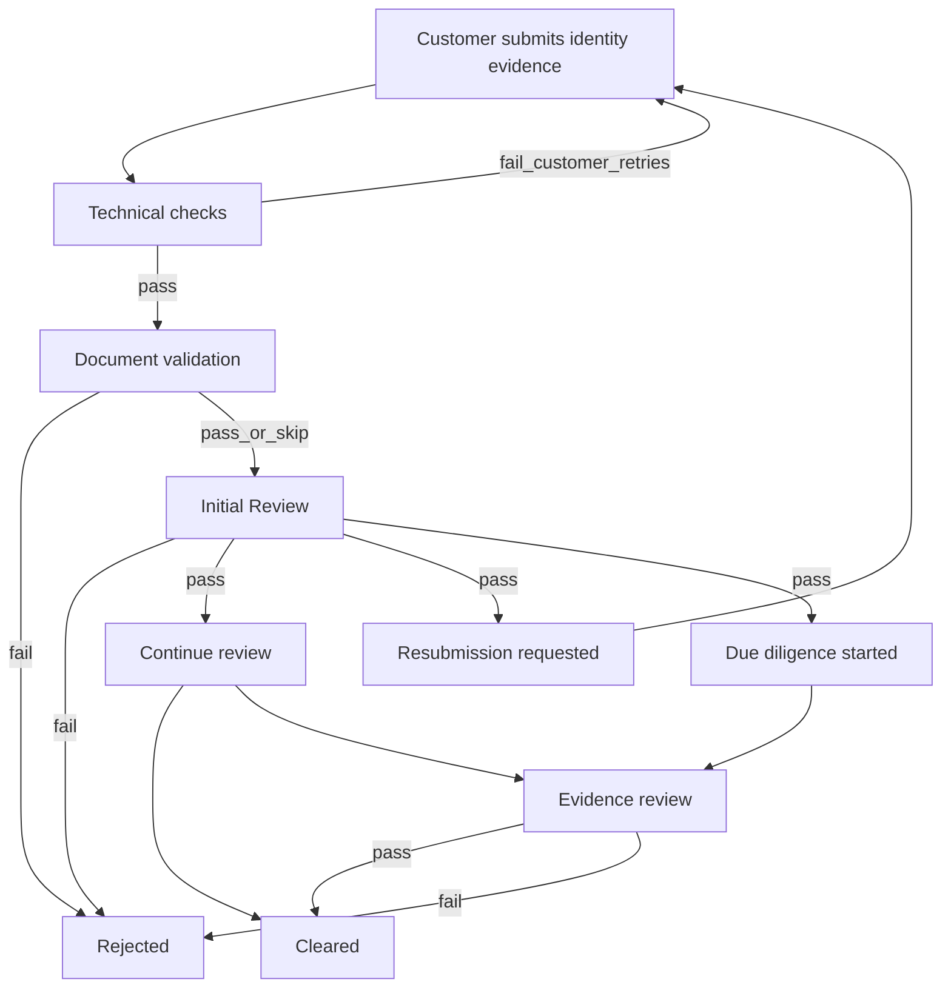

# Identity verification workflow (webhooks)

This guide describes the **end-to-end identity verification workflow** for integrators: what happens after a customer submits identity evidence, which **onboarding webhooks** Cleared sends at each stage, and how to consume them safely.

It is written for **public / merchant API consumers**. For low-level HMAC setup and the full event catalog, see [Onboarding (IDV) webhooks](../onboarding/onboarding-webhooks.md). For REST endpoints, see [Identity API Overview](./identity-api.md) and [Identity Endpoints](./identity-endpoints.md).

---

## Who this is for

| You are… | Use this guide to… |
|----------|--------------------|
| Loan / onboarding integrator | Drive your application state machine from Cleared webhooks |
| Backend engineer | Verify signatures, parse `eventName` / `eventContext`, stay idempotent |
| Product owner | Understand which stages are **pending** vs **terminal** |

---

## Workflow at a glance

After technical capture and document checks, Cleared operations complete an **Initial Review**. That review does **not** by itself clear or reject the identity. After Initial Review, the case may continue on one of several paths (including **due diligence**), until a **final** cleared or rejected decision.



**Important product rule:** **Initial Review** and **due diligence** are different stages. Completing Initial Review does **not** mean due diligence has started. Due diligence is started later by a separate ops action and emits its own webhook.

### What Initial Review means

**Initial Review** means an agent (human and/or machine) has reviewed the identity submission and is satisfied that it meets the requirements for **preliminary clearance**.

In practical terms:

- The evidence already submitted is **good enough** that the case can eventually reach a straight clearance, or can be cleared after some additional work (for example more information, a partial resubmission, or due diligence).
- It is **not** a final clear or reject. More information may still be required, or the subject may need to resubmit some captures.
- That is different from a submission that is **most likely headed for rejection** (poor evidence, failed checks, or an Initial Review reject path that ends in `identityVerificationRejected`).

So when you receive `initialReviewCompleted`, treat it as: *“This submission is on a viable path to clearance — keep waiting for later webhooks.”* Do **not** unlock identity-gated steps yet.

---

## Webhook events in this workflow

All onboarding webhook `eventName` values are **camelCase**. Cleared may also send earlier progress events (`identityVerificationStarted`, `identityVerificationSubmitted`, …). This guide focuses on the **decision path** after submission.

| Stage | Webhook `eventName` | Terminal? | Typical integrator action |
|-------|---------------------|-----------|---------------------------|
| Customer submitted / journey progress | `identityVerificationSubmitted` (and related progress events) | No | Mark application “ID received / in review” |
| Initial Review completed | `initialReviewCompleted` | No | Store assurance level; branch on resubmission vs continue |
| Due diligence started | `dueDiligenceStarted` | No | Mark “enhanced review”; do **not** treat as cleared |
| Identity cleared | `identityVerificationCleared` | **Yes** (success) | Unlock loan / proceed |
| Identity rejected | `identityVerificationRejected` | **Yes** (failure) | Stop / ask customer to restart per your policy |

> **Event names (exact):** Cleared sends these catalog ids only — use them in your `switch` / handlers:
> - Success: `identityVerificationCleared`
> - Failure: `identityVerificationRejected`
>
> Cleared does **not** send bare `cleared` or `rejected` as `eventName`. Matching on those strings will miss the event.

> **Resubmission:** There is **no** catalog event named `resubmissionInitiated` or `resubmissionCompleted`. When ops requests new media after Initial Review, Cleared signals that on **`initialReviewCompleted`** with `eventContext.resubmissionRequired: true` (and usually `nextCaseStatus: "awaiting_resubmission"`). The customer is contacted by Cleared to upload again; when they re-submit, you typically see another **`identityVerificationSubmitted`** (and later a new decision path).

Subscribe via the **Verification portal** webhook binding (optional `subscribedEvents` whitelist). Unset / omit the list to receive all catalog events. Details: [Onboarding webhooks — Configuration](../onboarding/onboarding-webhooks.md#configuration).

---

## Delivery contract (every stage)

Cleared sends `POST` to your HTTPS URL.

| Item | Behaviour |
|------|-----------|
| Header | `Content-Type: application/json` |
| Header | `X-Webhook-Signature: sha256=<hex>` when a secret is configured |
| Body | VerificationStatus-style envelope (see below) |
| Delivery | **At-least-once** — you may receive duplicates |
| Your response | Prefer **2xx quickly**; verify signature before trusting the body |

### Envelope fields you should always read

| Field | Use |
|-------|-----|
| `eventName` | Primary switch for your handler |
| `eventOccurredAt` | ISO timestamp — include in idempotency keys |
| `eventContext` | Stage-specific payload (shape depends on `eventName`) |
| `onboarding.urlParameters` | Your correlation ids (e.g. loan application id) from the onboarding page |
| `verifications` | Snapshot rows (`type`, `status`, identity fields when present) |
| `customerName` / `customerEmailAddress` | Display / matching (do not treat email alone as a secret) |

### Idempotency (required)

Treat deliveries as at-least-once. A practical key:

```text
idempotencyKey = eventName + "|" + eventOccurredAt + "|" + onboarding.urlParameters.<yourAppId>
```

Optionally also include `eventContext.resultId` when present.

### Minimal handler skeleton

```javascript
// Pseudocode — verify HMAC on the raw body BEFORE JSON.parse in production.
async function handleClearedOnboardingWebhook(rawBody, signatureHeader, secret) {
  assertValidHmacSha256(rawBody, signatureHeader, secret); // throw → 401

  const payload = JSON.parse(rawBody);
  const key = [
    payload.eventName,
    payload.eventOccurredAt,
    payload.onboarding?.urlParameters?.applicationId, // your field name
  ].join('|');

  if (await alreadyProcessed(key)) return { ok: true, duplicate: true };

  switch (payload.eventName) {
    case 'identityVerificationSubmitted':
      await onIdentitySubmitted(payload);
      break;
    case 'initialReviewCompleted':
      await onInitialReviewCompleted(payload);
      break;
    case 'dueDiligenceStarted':
      await onDueDiligenceStarted(payload);
      break;
    case 'identityVerificationCleared':
      await onIdentityCleared(payload);
      break;
    case 'identityVerificationRejected':
      await onIdentityRejected(payload);
      break;
    default:
      // Unknown / unused catalog events — acknowledge 2xx so Cleared does not retry forever
      break;
  }

  await markProcessed(key);
  return { ok: true };
}
```

---

## Stage 1 — Customer submits identity evidence

**What happens:** The customer completes the Cleared capture journey (document images, selfie / liveness as configured). Cleared runs technical checks (file type, integrity, readability, blur/brightness, liveness). Failures usually return the customer to capture; they are not final rejection.

**Webhook you typically receive:** `identityVerificationSubmitted` (and possibly earlier `identityVerificationStarted`).

### How to consume

1. Resolve your loan / application from `onboarding.urlParameters`.
2. Set internal status to something like `identity_in_review` or `identity_submitted`.
3. **Do not** treat this as cleared.

### Example envelope (abbreviated)

```json
{
  "topic": "VerificationStatus",
  "eventName": "identityVerificationSubmitted",
  "eventOccurredAt": "2026-07-25T14:01:00.000Z",
  "customerName": "Alex Example",
  "customerEmailAddress": "alex@example.com",
  "onboarding": {
    "pageId": "64aa…",
    "onboardingPageId": "64aa…",
    "urlParameters": {
      "applicationId": "LOAN-10042"
    }
  },
  "verifications": [
    {
      "type": "identity",
      "status": "submitted",
      "documentType": "nationalIdCard"
    }
  ],
  "eventContext": {}
}
```

---

## Stage 2 — Initial Review completed

**What happens:** Cleared completes **Initial Review**: an agent (human and/or machine) has reviewed the submission and is satisfied it meets requirements for **preliminary clearance**. An early **assurance level** may be assigned (`1` / `2` / `3`). The identity is still **pending** a final clear/reject — more information or a partial resubmission may still follow, but the evidence is considered viable enough to clear eventually (with or without extra work), rather than a submission that is most likely to be rejected. See [What Initial Review means](#what-initial-review-means).

**Webhook:** `initialReviewCompleted`  
**Not sent when:** Initial Review is rejected into the identity reject path (you get `identityVerificationRejected` instead — see Stage 5).

`eventContext.finalStatus` is always `"pending"` for this event.

### `eventContext` fields

| Field | Meaning |
|-------|---------|
| `resultId` | Identity verification result id |
| `verificationType` | `"identity"` |
| `source` | e.g. `ops_initial_review_triage_advance` or `ops_initial_review_complete` |
| `level` | `1`, `2`, `3`, or `null` (legacy mark-complete) |
| `riskCategory` | `low` / `medium` / `high` from level, or `null` |
| `reasonCodes` | Catalog reason codes (may be `[]`) |
| `caseStatus` | Underlying identity status after advance (e.g. `processing`) |
| `nextCaseStatus` | Ops choice: `continue_review` or `awaiting_resubmission` (not due diligence) |
| `resubmissionRequired` | `true` when customer must send more media |
| `resubmission` | When required: `{ "requestId": "…", "labels": ["idFront", …] }` |
| `reviewedAt` | ISO timestamp |
| `reviewDurationMs` | Ops review duration in ms, or `null` |
| `finalStatus` | Always `"pending"` |

### How to consume

Branch on **`resubmissionRequired`** / **`nextCaseStatus`**, not only on `level`:

| Condition | Recommended integrator behaviour |
|-----------|----------------------------------|
| `resubmissionRequired === false` and `nextCaseStatus === "continue_review"` | Keep waiting for final clear/reject (and possibly `dueDiligenceStarted`) |
| `resubmissionRequired === true` | Mark application “awaiting customer ID re-upload”; do not clear the loan |
| `level === 3` without due diligence yet | Higher risk signal only — **wait** for either clear/reject or `dueDiligenceStarted` |

**Do not** treat `initialReviewCompleted` as cleared, rejected, or “due diligence started”.

### Example — continue review

```json
{
  "eventName": "initialReviewCompleted",
  "eventOccurredAt": "2026-07-25T14:10:00.000Z",
  "onboarding": {
    "urlParameters": { "applicationId": "LOAN-10042" }
  },
  "eventContext": {
    "resultType": "IdentityVerificationResult",
    "verificationType": "identity",
    "resultId": "64f1a2b3c4d5e6f7a8b9c0d1",
    "source": "ops_initial_review_triage_advance",
    "level": 1,
    "riskCategory": "low",
    "reasonCodes": [],
    "caseStatus": "processing",
    "nextCaseStatus": "continue_review",
    "resubmissionRequired": false,
    "reviewedAt": "2026-07-25T14:10:00.000Z",
    "finalStatus": "pending",
    "reviewDurationMs": 120000
  }
}
```

```javascript
async function onInitialReviewCompleted(payload) {
  const appId = payload.onboarding?.urlParameters?.applicationId;
  const ctx = payload.eventContext || {};

  await updateApplication(appId, {
    identityResultId: ctx.resultId,
    initialReviewLevel: ctx.level,
    riskCategory: ctx.riskCategory,
    identityPhase: ctx.resubmissionRequired
      ? 'awaiting_customer_resubmission'
      : 'initial_review_complete',
  });

  if (ctx.resubmissionRequired) {
    await notifyOpsOrCustomer(appId, {
      reason: 'identity_resubmission_required',
      labels: ctx.resubmission?.labels || [],
    });
  }
}
```

### Example — resubmission requested (via Initial Review)

```json
{
  "eventName": "initialReviewCompleted",
  "eventOccurredAt": "2026-07-25T14:12:00.000Z",
  "onboarding": {
    "urlParameters": { "applicationId": "LOAN-10042" }
  },
  "eventContext": {
    "resultType": "IdentityVerificationResult",
    "verificationType": "identity",
    "resultId": "64f1a2b3c4d5e6f7a8b9c0d1",
    "source": "ops_initial_review_triage_advance",
    "level": 2,
    "riskCategory": "medium",
    "reasonCodes": ["DOCUMENT_BLURRED"],
    "caseStatus": "processing",
    "nextCaseStatus": "awaiting_resubmission",
    "resubmissionRequired": true,
    "resubmission": {
      "requestId": "gs_abc123",
      "labels": ["idFront", "idBack"]
    },
    "reviewedAt": "2026-07-25T14:12:00.000Z",
    "finalStatus": "pending",
    "reviewDurationMs": 240000
  }
}
```

After the customer uploads again, expect another **`identityVerificationSubmitted`** (and later another ops path). Keep correlating on `applicationId` / `resultId`.

---

## Stage 3 — Due diligence started

**What happens:** After Initial Review, an agent may start **enhanced due diligence** (extended evidence review). This is a **separate** action from Initial Review.

**Webhook:** `dueDiligenceStarted`  
**Prerequisite in practice:** You should already have received `initialReviewCompleted` for the same identity result (same `resultId` when present).

`eventContext.finalStatus` is `"pending"`. The case is **not** cleared.

### `eventContext` fields

| Field | Meaning |
|-------|---------|
| `resultId` | Identity verification result id |
| `verificationType` | `"identity"` |
| `source` | Typically `ops_due_diligence_started` |
| `caseStatus` | `"due_diligence"` |
| `dueDiligenceCategory` | Optional category string, or `null` |
| `reasonCodes` | May be empty |
| `startedAt` | ISO timestamp |
| `finalStatus` | Always `"pending"` |

### How to consume

1. Set application phase to `identity_due_diligence` (or equivalent).
2. Optionally surface “additional review in progress” in your UI.
3. Continue waiting for `identityVerificationCleared` or `identityVerificationRejected`.
4. **Never** auto-approve the loan on this event.

### Example

```json
{
  "eventName": "dueDiligenceStarted",
  "eventOccurredAt": "2026-07-25T15:00:00.000Z",
  "onboarding": {
    "urlParameters": { "applicationId": "LOAN-10042" }
  },
  "eventContext": {
    "resultType": "IdentityVerificationResult",
    "verificationType": "identity",
    "resultId": "64f1a2b3c4d5e6f7a8b9c0d1",
    "source": "ops_due_diligence_started",
    "caseStatus": "due_diligence",
    "dueDiligenceCategory": "enhanced",
    "reasonCodes": [],
    "startedAt": "2026-07-25T15:00:00.000Z",
    "finalStatus": "pending"
  }
}
```

```javascript
async function onDueDiligenceStarted(payload) {
  const appId = payload.onboarding?.urlParameters?.applicationId;
  const ctx = payload.eventContext || {};

  await updateApplication(appId, {
    identityResultId: ctx.resultId,
    identityPhase: 'due_diligence',
    dueDiligenceCategory: ctx.dueDiligenceCategory,
    dueDiligenceStartedAt: ctx.startedAt,
  });
}
```

---

## Stage 4 — Cleared (final success)

**What happens:** Ops completes evidence review and **clears** the identity.

**Webhook:** `identityVerificationCleared`

This is a **terminal success** for the identity verification result. Your product may still have other gates (TRN, address, credit, etc.).

### How to consume

1. Confirm `eventName === "identityVerificationCleared"`.
2. Read identity row under `verifications` (status / document type / dates when present).
3. Advance your application to the next gate (or complete IDV).
4. Persist `resultId` / cleared timestamp for audit.

### Example envelope (abbreviated)

```json
{
  "eventName": "identityVerificationCleared",
  "eventOccurredAt": "2026-07-25T16:05:00.000Z",
  "customerName": "Alex Example",
  "onboarding": {
    "urlParameters": { "applicationId": "LOAN-10042" }
  },
  "verifications": [
    {
      "type": "identity",
      "status": "cleared",
      "documentType": "nationalIdCard",
      "clearedAt": "2026-07-25T16:05:00.000Z"
    }
  ],
  "eventContext": {}
}
```

```javascript
async function onIdentityCleared(payload) {
  const appId = payload.onboarding?.urlParameters?.applicationId;
  const identity = (payload.verifications || []).find((v) => v.type === 'identity');

  await updateApplication(appId, {
    identityPhase: 'cleared',
    identityStatus: identity?.status,
    identityClearedAt: identity?.clearedAt || payload.eventOccurredAt,
  });

  await maybeUnlockNextStep(appId); // your policy
}
```

---

## Stage 5 — Rejected (final failure)

**What happens:** Ops rejects the identity (from Initial Review fail path, due diligence fail, or other decision paths).

**Webhook:** `identityVerificationRejected`

This is a **terminal failure** for that identity result.

### How to consume

1. Mark application identity as rejected.
2. Do **not** unlock identity-gated steps.
3. Follow your product policy (new journey, manual review, decline).

### Example envelope (abbreviated)

```json
{
  "eventName": "identityVerificationRejected",
  "eventOccurredAt": "2026-07-25T16:08:00.000Z",
  "onboarding": {
    "urlParameters": { "applicationId": "LOAN-10042" }
  },
  "verifications": [
    {
      "type": "identity",
      "status": "rejected",
      "documentType": "nationalIdCard"
    }
  ],
  "eventContext": {}
}
```

---

## Recommended state machine

Map Cleared events onto your application’s identity phase. Example:

```text
none
  → (identityVerificationSubmitted) → submitted
  → (initialReviewCompleted, no resub) → initial_review_complete
  → (initialReviewCompleted, resubmissionRequired) → awaiting_customer_resubmission
       → (identityVerificationSubmitted) → submitted   // loop
  → (dueDiligenceStarted) → due_diligence
  → (identityVerificationCleared) → cleared            // terminal success
  → (identityVerificationRejected) → rejected          // terminal failure
```

Rules of thumb:

1. Only **`identityVerificationCleared`** and **`identityVerificationRejected`** are terminal for identity.
2. **`initialReviewCompleted`** and **`dueDiligenceStarted`** always leave you **pending**.
3. Out-of-order / duplicate deliveries: use idempotency keys; prefer the latest terminal event for a given `resultId` if you ever see both (should be rare).

---

## Suggested `subscribedEvents` whitelist

If you only care about the identity decision path:

```json
[
  "identityVerificationSubmitted",
  "initialReviewCompleted",
  "dueDiligenceStarted",
  "identityVerificationCleared",
  "identityVerificationRejected"
]
```

Omit the list entirely if you want the full catalog (including other verification types).

---

## Common mistakes

| Mistake | Correct approach |
|---------|------------------|
| Treat `initialReviewCompleted` as cleared | Wait for `identityVerificationCleared` |
| Treat `dueDiligenceStarted` as cleared | Wait for clear/reject |
| Assume Initial Review “includes” due diligence | Separate events; DD is after IR |
| Match on `eventName` values `cleared` or `rejected` | Match **exactly** `identityVerificationCleared` / `identityVerificationRejected` |
| Expect `resubmissionInitiated` / `resubmissionCompleted` | Use IR `resubmissionRequired` + later `identityVerificationSubmitted` |
| Ignore HMAC / process before verify | Verify `X-Webhook-Signature` on the **raw** body first |
| Assume exactly-once delivery | Design for at-least-once + idempotency |

---

## Related documents

| Document | Contents |
|----------|----------|
| [Onboarding (IDV) webhooks](../onboarding/onboarding-webhooks.md) | HMAC, catalog, deep dives for IR / due diligence context fields |
| [Client loan / onboarding workflow](../client-loan-application-workflow.md) | Broader loan journey including webhooks |
| [Identity API Overview](./identity-api.md) | Features and REST concepts |
| [Identity Endpoints](./identity-endpoints.md) | Merchant identity REST reference |
| [Endpoints overview](../endpoints.md) | Base URLs and common API patterns |

---

## Change summary (integrator-facing)

| Change | Effect on you |
|--------|----------------|
| Initial Review vs due diligence split | You may receive `initialReviewCompleted` and later `dueDiligenceStarted` as **two** events |
| Final outcomes unchanged | Still `identityVerificationCleared` / `identityVerificationRejected` |
